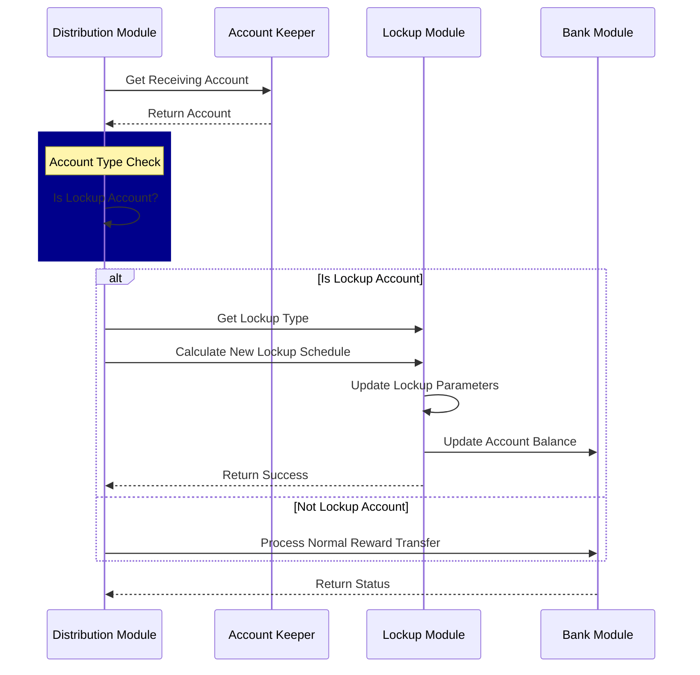

| cip            | 31                                                                                                                      |
|----------------|-------------------------------------------------------------------------------------------------------------------------|
| title          | Incorporate staking rewards into vesting account schedules                                                              |
| description    | Dynamically update vesting schedules to include newly earned staking rewards                                            |
| author         | Dean Eigenmann ([@decanus](https://github.com/decanus)), Marko Baricevic ([@tac0turtle](https://github.com/tac0turtle)) |
| discussions-to | [Forum Discussion](https://forum.celestia.org/t/cip-lockup-accounts-staking-rewards/1908)                               |
| status         | Last Call                                                                                                               |
| last-call-date | 2025-04-02                                                                                                              |
| type           | Standards Track                                                                                                         |
| category       | Core                                                                                                                    |
| created        | 2025-02-07                                                                                                              |
| requires       | N/A                                                                                                                     |

---

## Abstract

*Note: in the software lockup accounts are referred to vesting accounts, for this document we will refer to them as lockup accounts.*

This CIP proposes integrating staking rewards directly into lockup accounts. When a lockup account receives rewards from staking, the system adds the reward amount to the lockup balance and recalculates the daily unlock rate over the remaining lockup period. This mechanism ensures that reward tokens remain subject to an account’s existing lockup constraints while still providing incentive to secure the network through staking.

## Motivation

The default design of the lockup accounts in most Proof-of-Stake blockchains is that locked tokens can be staked and earn rewards, but these rewards are not subject to the lockup schedule. This has led to recipients of locked tokens being able to sell staking rewards independently of their unlock schedule, arguably in tension with the purpose of lockup accounts.

By integrating staking rewards directly into the lockup schedule, this proposal incentivizes locked tokens to secure the network while ensuring that staking rewards are locked. Summarizing the motivations:

- **Consistency:** Ensures that all tokens under a lockup account—whether from the initial locked amount or subsequently earned rewards—are subject to the same unlock schedule.
- **Security:** Prevents immediate liquidity from staking rewards without removing incentive to secure the network.
- **Simplicity:** Leverages existing modules (distribution, lockup, bank) with minimal disruption by adding hooks and type checks.

## Specification

### Core Mechanism

1. **Account Type Verification:**
   When staking rewards are distributed (e.g., via `MsgWithdrawDelegatorReward`), the distribution module will first check if the receiving account is a lockup account.

   - **If it is:**
     - Verify that it is of a modifiable lockup type.
     - Calculate the new lockup amount:
       `New Lockup Amount = Original Lockup Amount + Claimed Rewards`
     - Determine the new unlock rate by dividing the updated lockup amount by the remaining lockup period.
     - Update the lockup schedule and the account balance accordingly.
   - **If it is not a lockup account:**
     - Process the reward as a normal reward transfer.

2. **Reward Claim Paths:**
   The CIP covers multiple paths where rewards might be integrated:

   - **Direct Reward Claim:**
     The user invokes a reward withdrawal message and the lockup schedule is updated.

   - **Redelegation and Unbonding:**
     Hooks in the staking module ensure rewards are claimed and added to the lockup schedule prior to processing redelegation or unbonding.
     - *Note: IF [CIP-30](https://github.com/celestiaorg/CIPs/pull/251) is accepted this path is no longer available.*

   - **Validator Commission:**
     Commission rewards are split from staking rewards: commissions go directly to the account (unlocked) while staking rewards follow the lockup schedule.

3. **Token State Management:**
   Tokens are tracked in four states:

   - Locked & Unstaked
   - Locked & Staked
   - Unlocked & Unstaked
   - Unlocked & Staked

4. **Mathematical Model & Example:**
   For a lockup schedule of 100 tokens over 365 days (≈0.274 tokens/day), once 30% of the tokens have unlocked, claiming a reward of about 0.657 tokens immediately unlocks 30% (≈0.197 tokens) while the remaining 70% (≈0.460 tokens) is added to the locked balance. This brings the locked amount to roughly 70.460 tokens, which will continue unlocking over the remaining 70% of the period (approximately 255.5 days), yielding an updated daily unlock rate of about 0.276 tokens/day.

    *NOTE: reward calculation is arbitrary, it is not based on Celestia's inflation.*

5. **Error Handling:**
   - Ensure sufficient balance checks before processing rewards.
   - Validate that the lockup period is still active.
   - Separate commission transfers from reward lockup updates.

### Module Interaction

The following sequence summarizes the module interactions:

### Commission Cap

As part of this CIP we also propose capping the validator commission at 25%. A commission cap is required to avoid circumvention of this CIP by large token holders, who could spin up a new validator with 100% commission, where such commission would be fully unlocked.

The commission cap will also be applied to validators who were created prior to the upgrade but are unbonded. This prevents new validators from being created today in order to avoid the cap in the future.

# Parameters

When upgrading to v4 we propose introducing a migration that will set the Parameter in [`x/Staking`](https://github.com/cosmos/cosmos-sdk/blob/release/v0.50.x/x/staking/types/staking.pb.go#L934) to 25% disallowing new validators from creating validators with \>25% commission rates.

# Backwards Compatibility

All existing lockup accounts will be subject to the locking system. This change will take effect in v4, since this is a larger upgrade there is not a need for backwards compatible systems.

# Test Cases

The implementation should include test cases covering:

- **Basic Reward Claim:**
  - Claim rewards multiple times and verify that the lockup schedule updates correctly.
- **Redelegation with Rewards:**
  - Ensure the hook triggers before redelegation and that rewards are claimed and added to lockup.
- **Unbonding with Rewards:**
  - Verify that the lockup schedule is updated correctly prior to unbonding.
- **Validator Commission Path:**
  - Confirm that commission rewards are processed normally (non-locked) while staking rewards are added to the lockup schedule.

# Reference Implementation

A reference implementation will be provided in the Celestia codebase under the distribution and lockup modules. It includes the modifications to the reward claim functions, the new lockup schedule recalculation logic, and updated tests demonstrating correct behavior for all outlined paths. The PR can be found at <https://github.com/01builders/cosmos-sdk/pull/10>.

# Security Considerations

- **Integrity of Lockup Schedules:**
  The recalculation of lockup schedules must be atomic and resistant to race conditions. Any failure in updating the lockup schedule should not lead to inconsistencies in account balances.

- **Separation of Rewards:**
  The design ensures that validator commissions are kept separate from staking rewards that enter lockup, preventing accidental over-lockup.

- **Error Handling:**
  Adequate checks are in place for balance sufficiency, lockup period validity, and correct module interactions to prevent unexpected token inflation or loss.

## Copyright

Copyright and related rights waived via [CC0](https://github.com/celestiaorg/CIPs/blob/main/LICENSE).
