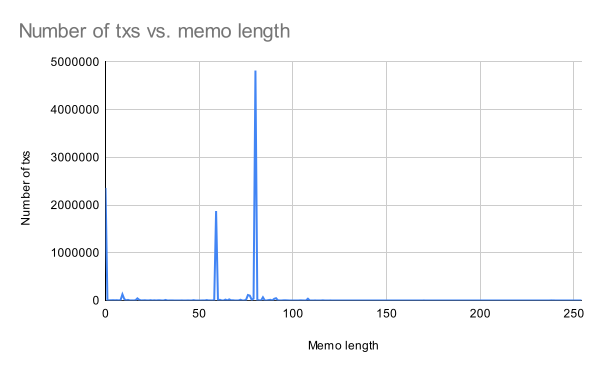

| cip | title                 | description                            | author                          | discussions-to                                                                                              | status | type            | category | created    |
|-----|-----------------------|----------------------------------------|---------------------------------|-------------------------------------------------------------------------------------------------------------|--------|-----------------|----------|------------|
| 15  | Discourage memo usage | Discourage memo usage by modifying two auth params. | Rootul Patel (@rootulp), NashQueue (@nashqueue) | <https://forum.celestia.org/t/cip-discourage-memo-usage/1508>                         | Draft  | Standards Track | Core     | 2024-01-21 |

## Abstract

This proposal aims to discourage the use of transaction memos in Celestia by modifying two parameters:

- Decrease `auth.MaxMemoCharacters` from 256 to 16.
- Increase `auth.TxSizeCostPerByte` from 10 to 16.

Additionally, this CIP converts these two parameters from governance modifiable to hard-coded values that are unmodifiable by governance.

## Motivation

Transactions on Celestia may optionally include a user-specified memo. The Cosmos SDK describes the memo as "a note or comment to send with the transaction". The memo field is often used by centralized exchanges to uniquely identify the user depositing into an exchange. The memo field has also been used by IBC relayers to tag IBC transactions with the relayer's name and software version.

Recently, a number of [inscriptions](https://trustmachines.co/glossary/inscriptions/) projects on Cosmos chains have built entire protocols based on the information transmitted via the memo field. One such project that launched on Celestia is CIAS. For example, see [this tx](https://celenium.io/tx/0facb4c1d38e12574ccef8ed2a22d99300b6c91f08470cd75000d30f9f45412e) which has a memo field that base64 decodes to

```txt
data:,{"op":"cancel","amt":3230000,"tick":"cias","p":"cia-20"}
```

based on the [CIAS docs](https://docs.cias.wtf/) this memo cancels an inscription listing. There are similar memos to deploy, mint, transfer, and list inscriptions.

On one hand, it is exciting to see protocols launch on top of Celestia. On the other hand, this usage poses risks to the Celestia network.

Celestia was designed to support the publication of arbitrary data but the memo field is not the ideal mechanism to publish such data. One of the design goals stated in the original [LazyLedger](https://arxiv.org/pdf/1905.09274.pdf) paper is:

> Application message retrieval partitioning. Client nodes must be able to download all of the messages relevant to the applications they use from storage nodes, without needing to downloading any messages for other applications.

For this reason, blob data is scoped to an application-specific namespace. However, the transaction memo field is not scoped to an application-specific namespace. Instead, it pollutes the reserved [`TRANSACTION_NAMESPACE`](https://celestiaorg.github.io/celestia-app/specs/namespace.html#reserved-namespaces). This is undesirable because partial nodes that want to verify the current Celestia state must download and execute all transactions in the `TRANSACTION_NAMESPACE` (including memos).

As of January 17, 2024, 0.51 GiB of data has been published to the Celestia network via memos and 1.46 GiB of data has been published via blob data.

This proposal seeks to realign incentives so that protocol builders are encouraged to favor application-specific namespace blob data over memo fields.

## Specification

Param                    | Current | Proposed
-------------------------|---------|---------
`auth.MaxMemoCharacters` | 256     | 16
`auth.TxSizeCostPerByte` | 10      | 16

## Rationale

### `auth.MaxMemoCharacters`

`auth.MaxMemoCharacters` places an upper bound on the number of characters in the memo field. Note that not all uses of the memo field are nefarious:

1. Crypto exchanges use memos to uniquely identify the user depositing into an exchange.

    Exchange | Memo characters
    ---------|----------------
    Binance  | 13
    Bithumb  | 10
    Coinbase | 10
    Gemini   | 13
    KuCoin   | 10

2. Some IBC relayers include the Hermes version in their memo. For [example](https://www.mintscan.io/celestia/tx/5FED84C1DA596EFC7F9005866573B31CC593770C6022B16B60834F1D22365E49?height=556792): `mzonder | hermes 1.7.4+ab73266 (https://hermes.informal.systems)` which is 64 characters.

Given this context, what is the distribution of memo lengths in practice? How often are they used vs. empty?



Observe that the distribution of memo lengths is spikey at 80 and 59 characters. The spike at 0 is expected (txs by default don't contain a memo). To learn why the other spikes exist, we have to inspect the most common memos:

<!-- markdownlint-disable MD034 -->
Tx count | Memo length | Memo                                                                                         | Base64 decoded
---------|-------------|----------------------------------------------------------------------------------------------|-------------------------------------------------------------
4296795  | 80          | ZGF0YToseyJvcCI6Im1pbnQiLCJhbXQiOjEwMDAwLCJ0aWNrIjoiY2lhcyIsInAiOiJjaWEtMjAifQ==             | data:,{"op":"mint","amt":10000,"tick":"cias","p":"cia-20"}
1874034  | 59          | data:,{"op":"mint","amt":100000,"tick":"TIMS","p":"tia-20"}                                  | N/A
210265   | 80          | ZGF0YToseyJvcCI6Im1pbnQiLCJhbXQiOjEwMDAwMCwidGljayI6IlRJTVMiLCJwIjoidGlhLTIwIn0=             | data:,{"op":"mint","amt":100000,"tick":"TIMS","p":"tia-20"}
78409    | 77          | Yours truly, ValiDAO \| hermes 1.7.1+0658526 (https://hermes.informal.systems)               | N/A
66181    | 80          | ZGF0YToseyJwIjoiY2lhLTIwIiwib3AiOiJtaW50IiwidGljayI6ImNpYXMiLCJhbXQiOiIxMDAwMCJ9             | data:,{"p":"cia-20","op":"mint","tick":"cias","amt":"10000"}
65931    | 80          | ZGF0YToseyJwIjoic2VpLTIwIiwib3AiOiJtaW50IiwidGljayI6InNlaXMiLCJhbXQiOiIxMDAwIn0=             | data:,{"p":"sei-20","op":"mint","tick":"seis","amt":"1000"}
53313    | 80          | ZGF0YToseyJvcCI6Im1pbnQiLCJhbXQiOjEwMDAwLCJ0aWNrIjoiQ0lBUyIsInAiOiJjcmMtMjAifQ==             | data:,{"op":"mint","amt":10000,"tick":"CIAS","p":"crc-20"}
51378    | 80          | ZGF0YToseyJvcCI6Im1pbnQiLCJhbXQiOjEwMDAwLCJ0aWNrIjoiY2lhcyIsInAiOiJjcmMtMjAifQ==             | data:,{"op":"mint","amt":10000,"tick":"cias","p":"crc-20"}
40568    | 17          | Delegate(rewards)                                                                            | N/A
31932    | 91          | relayed by CryptoCrew Validators \| hermes 1.6.0+4b5b34ea2 (https://hermes.informal.systems) | N/A
31233    | 76          | Relayed by Stakin \| hermes 1.7.3+e529d2559 (https://hermes.informal.systems)                | N/A
<!-- markdownlint-enable MD034 -->

Observe that seven of the top ten are base64 encoded data. Three of the top ten are relayers. The last one: "Delegate(rewards)" appears to be the default memo applied via Keplr wallet for a delegate tx.

### `auth.TxSizeCostPerByte`

`auth.TxSizeCostPerByte` is the gas cost per byte of a transaction. The current value of 10 is a Cosmos SDK default and it is comparable to the current `blob.GasPerBlobByte` value of 8. In order to discourage the usage of the memo field and encourage the use of blob data, we propose increasing `auth.TxSizeCostPerByte` to 16 so that each memo byte costs roughly twice as much as a blob byte. It is worth noting that `auth.TxSizeCostPerByte` is important outside the context of transactions memos because this parameter is used for all transaction bytes. Non-memo transaction contents may similarly bloat the `TRANSACTION_NAMESPACE`.

How expensive are transactions after a `auth.TxSizeCostPerByte` increase?

`auth.TxSizeCostPerByte` | MsgSend without memo | MsgSend with 256 character memo | MsgPFB with 256 byte blob
-------------------------|----------------------|---------------------------------|--------------------------
10                       | 77004 gas            | 79594 gas                       | 67765 gas
16                       | 78906 gas            | 83050 gas                       | 69763 gas
100                      | 105534 gas           | 131434 gas                      | 97735 gas
1000                     | 390834 gas           | 649834 gas                      | 397435 gas

Assuming `minimum-gas-prices = "0.002utia"`

`auth.TxSizeCostPerByte` | MsgSend without memo | MsgSend with 256 character memo | MsgPFB with 256 byte blob
-------------------------|----------------------|---------------------------------|--------------------------
10                       | 154 utia             | 159 utia                        | 135 utia
16                       | 157 utia (+2%)       | 166 utia (+4%)                  | 139 utia (+3%)
100                      | 211 utia (+37%)      | 262 utia (+65%)                 | 195 utia (+44%)
1000                     | 781 utia (+407%)     | 1299 utia (+716%)               | 794 utia (+488%)

Therefore, increasing from 10 to 16 is a conserative increase.

### FAQ

**What do other blockchains use for these params?**

Param                    | Celestia | Cosmos Hub | Osmosis
-------------------------|----------|------------|--------
`auth.MaxMemoCharacters` | 256      | 512        | 256
`auth.TxSizeCostPerByte` | 10       | 10         | 10

**How does this proposal affect [ICS-020](https://github.com/cosmos/ibc/blob/0da326fbedfd2c96aad807ed25e6eafd1399db07/spec/app/ics-020-fungible-token-transfer/README.md?plain=1#L46) memos?**

The ICS-20 memo is distinct from the transaction memo so `auth.MaxMemoCharacters` does not constrain the ICS-20 memo field. The ICS-20 memo field counts towards a transaction's bytes so transactions with large ICS-20 memo fields will be more expensive if `auth.TxSizeCostPerByte` is increased. This is relevant because we can expect the usage and size of the ICS-20 memo field to increase if Packet Forward Middleware is adopted (see [CIP-9](./cip-9)).

**Why convert these params from governance modifiable to hard-coded values?**

The CIP process defined in [CIP-1](./cip-1.md) is distinct from on-chain governance which relies on token voting. The authors of this CIP would rather use the CIP process to reach "rough consensus" than implement the param changes desired via an on-chain governance proposal. Since the CIP process can not enforce the outcome of an on-chain governance vote, this CIP suggests removing the ability for on-chain governance to modify these parameters in favor of explicitly setting them via hard-coded values. Put another way, this CIP moves the authority to modify these parameters from on-chain governance to the CIP process. This is directionally consistent with the rationale for CIPs:

> We intend CIPs to be the primary mechanisms for proposing new features, for collecting community technical input on an issue, and for documenting the design decisions that have gone into Celestia.

One downside of moving these parameters from governance modifiable to CIP modifiable is that they will only be modifiable via subsequent hard-forks which are expected to be less frequent than the current on-chain governance voting period of one week.

## Backwards Compatibility

This proposal is backwards compatible. However, clients that hard-coded gas estimation based on the previous `auth.TxSizeCostPerByte` value will need to be updated.

## Test Cases

TBA

## Reference Implementation

Rough steps:

1. Add two parameters to the [paramfilter](https://github.com/celestiaorg/celestia-app/tree/main/x/paramfilter) block list.
1. Define two new versioned constants in the v2 directory for the two proposed parameter values.
1. Explicitly set the two parameters to the versioned constants defined in step 2.

## Security Considerations

Since this CIP restricts usage of the memo field, projects that are no longer viable will need to migrate to alternative mechanisms. Ideally project migrate to blob data but as [Data Insertion in Bitcoin's Blockchain](https://www.researchgate.net/publication/345644650_Data_Insertion_in_Bitcoin%27s_Blockchain) points out, there are other mechanisms to store data in a blockchain. The two most applicable alternatives in Celestia's case are:

1. Users could send 1utia to a fake address. Addresses are 20 bytes so a user could theoretically include 20 bytes of data per msg send.
1. The block proposer can include arbitrary data via their moniker.

This list is not exhaustive and there are likely other mechanisms to store data in Celestia.

## Future Work

Currently, the gas cost for a PayForBlob transaction accounts for the number of shares occupied by its blobs. Since shares are 512 bytes, in rare cases, it may be cheaper to publish small data via memos rather than blobs. We may consider future protocol changes to guarantee that blobs are always cheaper than memos. One possible solution is to charge a flat fee for transactions that include memos where the flat fee is greater than the cost of a blob that occupies one share.

## Copyright

Copyright and related rights waived via [CC0](../LICENSE).
