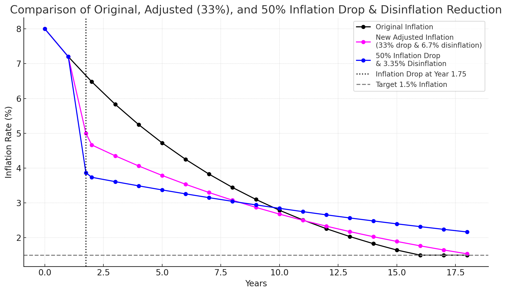

| cip            | 29                                                                                                                                        |
|----------------|-------------------------------------------------------------------------------------------------------------------------------------------|
| title          | Decrease Inflation and Adjust Disinflation                                                                                                |
| description    | This proposal lowers the Celestia inflation and disinflation by 33% to moderate issuance while maintaining competitive yield. |
| author         | Dean Eigenmann ([@decanus](https://github.com/decanus)), Marko Baricevic ([@tac0turtle](https://github.com/tac0turtle))                   |
| discussions-to | [Inflation Reduction Discussion Forum](https://forum.celestia.org/t/cip-reduce-inflation/1896)                                            |
| status         | Draft                                                                                                                                     |
| type           | Standards Track                                                                                                                           |
| category       | Core                                                                                                                                      |
| created        | 2025-02-04                                                                                                                                |

## **Abstract**

This CIP proposes to reduce both the Celestia inflation and disinflation by 33%. Celestia has a thriving ecosystem and already enjoys a significant share of the overall DA market. The current nominal inflation schedule also results in high dollar-value rewards for stakers. By "jumping" the inflation schedule forward, this proposal seeks to moderate total issuance, thereby reducing overall token dilution while still providing a yield that remains competitive to ensure the security of the network.

## **Motivation**

Celestia launched in October of 2023, and since its launch there has been a high demand for posting blobs to the network, while other solutions have not been able to scale in a decentralized manner. However, TIA's bonding has been continuously high (peaking at around 72% and currently at about 65%) meaning that stakers are overly incentivized.

While we have observed a large shift towards a dynamic inflation schedule: Solana, Near, and Cosmos, we believe that simplicity is key. Staying with a fixed inflation schedule provides a simple solution onchain and we believe that when Celestia's fee market matures and a diverse ecosystem of yield opportunities on TIA emerge, a more complex solution could be better justified. Instead, keeping it simple is better aligned with Celestia's ethos (and still allows for future changes).

The goal of this CIP is to reduce the inflation of Celestia immediately; both in a simple and understandable manner, as well as in an economically sustainable way guaranteeing staking rewards remain competitive over time.

Reasons for this CIP are:

1. Current issuance is too high, especially in dollar-terms. We want to avoid accelerated dilution of non-stakers.
2. To empower applications to compete effectively with staking yields. While it is important to maintain a high bond ratio (60%+) to secure the network, we also envision a vibrant ecosystem of diverse applications emerging on Celestia-secured rollups. Using TIA as collateral onchain competes with staking yield and reducing inflation makes onchain use more attractive.
3. By reducing inflation we reduce the amount of forced selling  due to taxes and other offchain liabilities. High inflation can contribute to centralization of a network by diluting non-stakers. If a set of users are staking with high inflation their stake and inadvertently their network power increases while a non-staker would see their network power decrease. While this is a property of PoS systems, higher inflation accelerates it.

At a 33% reduction the inflation rate is 4.82% in the first year of the reduction, and the APR is roughly 7.39% if the bonding ratio stays the same. This is currently around 2.2 times the APR of Ethereum staking, but Celestia is a smaller and younger network so a higher security budget is justified.

## **Specification**

### **Overview**

1. Reduce Inflation: We reduce the current inflation by 33% in the next upgrade (v4)  
2. Reduce Disinflation Rate: We reduce the disinflation rate by 33%  
3. Reward Calculation:

   * The reward distribution mechanism remains unchanged—rewards are still allocated pro rata to stakers and validators.

   * The only modification is to the base inflation parameter and the disinflation parameter; both drop by 33% on the next upgrade leading to lower yet sustainable inflation immediately

Implementers MUST ensure:

* The chain upgrade process includes the new inflation parameters without disrupting block production.

* The new schedule is included in the next major version release to reflect the updated inflation rates on-chain in the next app version (v4).

## **Parameters**

Below is the illustrative table showing the original versus the accelerated schedule. The "New Adjusted Inflation" column is an example of how inflation might look if we reduce it by 33% starting in the next upgrade. Note that for simplicity, the table assumes the inflation drop is applied at year 1.5 but if this proposal gets accepted, it would be immediately applied with the next upgrade.

|    Year | Original Inflation | New Adjusted Inflation | Notes                                                                   |
|--------:|-------------------:|-----------------------:|:------------------------------------------------------------------------|
|   **0** |               8.00 |                   8.00 | Genesis year, no change.                                                |
|   **1** |               7.20 |                   7.20 |                                                                         |
| **1.5** |               7.20 |                5.00088 | Reduce year 0 inflation by 33% and additionally apply 6.7% disinfaltion, lowering the inflation rate to 5.00088% |
|   **2** |               6.48 |                4.66582 | Regular annual disinflation applied (6.7%).                             |
|   **3** |               5.83 |                4.35321 | Regular annual disinflation applied (6.7%).                             |
|   **4** |               5.25 |                4.06155 | Regular annual disinflation applied (6.7%).                             |
|   **5** |               4.72 |                3.78942 | Regular annual disinflation applied (6.7%).                             |
|   **6** |               4.25 |                3.53553 | Regular annual disinflation applied (6.7%).                             |
|   **7** |               3.83 |                3.29865 | Regular annual disinflation applied (6.7%).                             |
|   **8** |               3.44 |                3.07764 | Regular annual disinflation applied (6.7%).                             |
|   **9** |               3.10 |                2.87144 | Regular annual disinflation applied (6.7%).                             |
|  **10** |               2.79 |                2.67905 | Regular annual disinflation applied (6.7%).                             |
|  **11** |               2.51 |                2.49956 | Regular annual disinflation applied (6.7%).                             |
|  **12** |               2.26 |                2.33209 | Regular annual disinflation applied (6.7%).                             |
|  **13** |               2.03 |                2.17584 | Regular annual disinflation applied (6.7%).                             |
|  **14** |               1.83 |                2.03005 | Regular annual disinflation applied (6.7%).                             |
|  **15** |               1.65 |                1.89404 | Regular annual disinflation applied (6.7%).                             |
|  **16** |               1.50 |                1.76714 | Regular annual disinflation applied (6.7%).                             |
|  **17** |               1.50 |                1.64874 | Regular annual disinflation applied (6.7%).                             |
|  **18** |               1.50 |                1.53828 | Regular annual disinflation applied (6.7%).                             |

To understand the numbers on how this would affect stakers please refer to the tables below:

Current schedule:

| Year   | Inflation Rate | APR (35% Staked) | APR (50% Staked) | APR (65% Staked) |
|:-------|:---------------|:-----------------|:-----------------|:-----------------|
| **0**  | 8.0            | 22.86            | 16.0             | 12.31            |
| **1**  | 7.2            | 20.57            | 14.4             | 11.08            |
| **2**  | 6.48           | 18.51            | 12.96            | 9.97             |
| **3**  | 5.83           | 16.66            | 11.66            | 8.97             |
| **4**  | 5.25           | 15.0             | 10.5             | 8.08             |
| **5**  | 4.72           | 13.49            | 9.44             | 7.26             |
| **6**  | 4.25           | 12.14            | 8.5              | 6.54             |
| **7**  | 3.83           | 10.94            | 7.66             | 5.89             |
| **8**  | 3.44           | 9.83             | 6.88             | 5.29             |
| **9**  | 3.1            | 8.86             | 6.2              | 4.77             |
| **10** | 2.79           | 7.97             | 5.58             | 4.29             |
| **11** | 2.51           | 7.17             | 5.02             | 3.86             |
| **12** | 2.26           | 6.46             | 4.52             | 3.48             |
| **13** | 2.03           | 5.8              | 4.06             | 3.12             |
| **14** | 1.83           | 5.23             | 3.66             | 2.82             |
| **15** | 1.65           | 4.71             | 3.3              | 2.54             |
| **16** | 1.5            | 4.29             | 3.0              | 2.31             |

Updated schedule:


|    Year | Inflation Rate | APR (35% Staked) | APR (50% Staked) | APR (65% Staked) |
|--------:|---------------:|-----------------:|-----------------:|-----------------:|
|   **0** |            8.0 |            22.86 |             16.0 |            12.31 |
|   **1** |            7.2 |            20.57 |             14.4 |            11.08 |
| **1.5** |        5.00088 |          14.2882 |          10.0018 |          7.69366 |
|   **2** |        4.66582 |          13.3309 |          9.33164 |          7.17819 |
|   **3** |        4.35321 |          12.4377 |          8.70642 |          6.69725 |
|   **4** |        4.06155 |          11.6044 |          8.12309 |          6.24853 |
|   **5** |        3.78942 |          10.8269 |          7.57884 |          5.82988 |
|   **6** |        3.53553 |          10.1015 |          7.07106 |          5.43928 |
|   **7** |        3.29865 |          9.42472 |           6.5973 |          5.07485 |
|   **8** |        3.07764 |          8.79326 |          6.15528 |          4.73483 |
|   **9** |        2.87144 |          8.20411 |          5.74288 |           4.4176 |
|  **10** |        2.67905 |          7.65444 |          5.35811 |          4.12162 |
|  **11** |        2.49956 |          7.14159 |          4.99911 |          3.84547 |
|  **12** |        2.33209 |           6.6631 |          4.66417 |          3.58782 |
|  **13** |        2.17584 |          6.21667 |          4.35167 |          3.34744 |
|  **14** |        2.03005 |          5.80016 |          4.06011 |          3.12316 |
|  **15** |        1.89404 |          5.41155 |          3.78808 |          2.91391 |
|  **16** |        1.76714 |          5.04897 |          3.53428 |          2.71868 |
|  **17** |        1.64874 |          4.71069 |          3.29748 |          2.53653 |
|  **18** |        1.53828 |          4.39508 |          3.07655 |          2.36658 |

## **Backwards Compatibility**

No backward compatibility issues are anticipated. This parameter change follows the standard CIP process, and current node operators should not require any additional changes besides upgrading to the new binary which automatically implements the changes discussed in this CIP.

## **Test Cases**

1. Parameter Verification Test:

   * Ensure that when the updated inflation parameters are applied at Year 3, the on-chain inflation rate reflects the new values instead of the old schedule.

2. Reward Distribution Test:

   * Validate that block rewards are distributed correctly under the new inflation rates.

## **Reference Implementation**

Below is a pseudo-code snippet for updating the inflation parameters. Actual implementation may vary by client:

Proposed implementation:

```go
const (
	// InitialInflationRateCip29 is the inflation rate specified in CIP-29.
	InitialInflationRateCip29 = 0.0536
	// DisinflationRateCip29 is the rate at which the inflation rate decreases each year (after CIP-29 was introduced).
	DisinflationRateCip29 = 0.067
)

func InitialInflationRateCip29AsDec() sdk.Dec {
	return initialInflationRateCip29AsDec
}

func DisinflationRateCip29AsDec() sdk.Dec {
	return disinflationRateCip29AsDec
}

// CalculateInflationRate returns the inflation rate for the current year depending on
// the current block height in context. The inflation rate is expected to
// decrease every year according to the schedule specified in the README.
func (m Minter) CalculateInflationRate(ctx sdk.Context, genesis time.Time) sdk.Dec {
	if ctx.ConsensusParams().Version.AppVersion <= 3 {
		return calculateInflationRatePreCip29(ctx, genesis)
	} else {
		return calculateInflationRatePostCip29(ctx, genesis)
	}
}

func calculateInflationRatePreCip29(ctx sdk.Context, genesis time.Time) sdk.Dec {
	years := yearsSinceGenesis(genesis, ctx.BlockTime())
	inflationRate := InitialInflationRateAsDec().Mul(sdk.OneDec().Sub(DisinflationRateAsDec()).Power(uint64(years)))

	if inflationRate.LT(TargetInflationRateAsDec()) {
		return TargetInflationRateAsDec()
	}
	return inflationRate
}

func calculateInflationRatePostCip29(ctx sdk.Context, genesis time.Time) sdk.Dec {
	if ctx.ConsensusParams().Version.AppVersion <= 3 {
		panic("calculateInflationRatePostCip29 should not be called with AppVersion <= 3")
	}

	years := yearsSinceGenesis(genesis, ctx.BlockTime())
	inflationRate := InitialInflationRateCip29AsDec().Mul(sdk.OneDec().Sub(DisinflationRateCip29AsDec()).Power(uint64(years)))
	if inflationRate.LT(TargetInflationRateAsDec()) {
		return TargetInflationRateAsDec()
	}
	return inflationRate
}
```

## **Alternative Approaches**

Alternatives that were considered.

### **Alternative 0: Do nothing**

If we continue to do nothing, Celestia's inflation schedule will end up competing with applications trying to offer alternative yield to stakers, therefore limiting TIA's onchain usage.

### **Alternative 1: Dynamic Inflation based on bonded ratio**

The Cosmos hub has a market dynamic inflation schedule/range where the inflation increases and decreases the further away current stake is from an ideal target amount of bonded stake.

Inflation \= CurrentInflation \+ (1 \- BondedRatio / GoalBonded) \* (InflationRateChange / BlocksPerYear)

Similarly, the Solana community is currently considering a similar approach but with vastly faster corrections than the Cosmos hub (see [SIMD-0228](https://github.com/solana-foundation/solana-improvement-documents/pull/228) for details).

Generally, the dynamic approach is more complex and less predictable. Celestia's community has a strong commitment to base layer simplicity and minimalism. A fixed inflation schedule is simple and less complex, probably less controversial, and the right answer at this point in time

### **Alternative 2: Accelerate the Inflation faster (or slower)**

Why not apply a disinflation rate of 10% only, or why not even a disinflation rate of 50%? We believe that a 33% drop of inflation and disinflation (as you can see by the numbers) has a sufficiently significant effect on the inflation without deviating too much from the original schedule. For comparison, here are the numbers if we applied 50% instead or kept the original schedule:



If we accelerate the schedule *slower*, the system continues over incentivising stakers and the change would not really move the needle as it would be too close to the current schedule. If we accelerate even faster, we risk hitting the target inflation of 1.5% too fast or generally risk lowering the inflation too much too early. Celestia mainnet is just about a year old and while there is already a thriving ecosystem, we want to err on the side of caution. A target inflation of <~5% seems ideal for a proof-of-stake system which is still early and whose tokenomics will play out in the future.
